# Serendib Hotels - Database

MySQL database schema for the Serendib Smart Hotel Management System.

**Last Updated:** December 2025

## Quick Setup

### Using XAMPP (Recommended)
1. Start XAMPP MySQL
2. Open phpMyAdmin: http://localhost/phpmyadmin
3. Create database: `serendib_hotels`
4. Import: `schema.sql`

### Using Command Line
```bash
mysql -u root -p < schema.sql
```

### Fix Passwords (Required!)
After importing, run password fix:
```bash
cd ../serendib-backend
source venv/Scripts/activate
python fix_passwords.py
```

## Database Tables

| Table | Description |
|-------|-------------|
| **Branch** | Hotel locations (Colombo, Mirissa, Kandy) |
| **User** | All users (guests, staff, admins) |
| **Room** | Room inventory |
| **Booking** | Reservations |
| **Payment** | Transactions |
| **ServiceRequest** | Guest requests |
| **Notification** | System alerts |
| **Staff** | Staff details |
| **LoyaltyProgram** | Points & tiers |
| **LoyaltyHistory** | Points transactions |
| **AuditLog** | Audit trail |
| **PropertyConfig** | Branch configs |
| **Promotion** | Discount codes |
| **Shift** | Staff schedule assignments |
| **Facility** | Pool, gym, spa, event halls |
| **FacilitySlot** | Time slots for facilities |
| **FacilityBooking** | Facility reservations |
| **FacilityAddOn** | Catering, decoration, equipment |

### Recent Schema Updates
- **Facility Booking System (Dec 2025):** Added `Facility`, `FacilitySlot`, `FacilityBooking`, `FacilityAddOn` tables for pool/gym/spa/event hall management.
- **Service Pricing:** Added `price`, `is_chargeable`, `is_billed`, `billed_at` to `ServiceRequest` table for itemized billing.

## Migration Notes
If you are updating an existing database, run the facility tables migration:

```bash
mysql -u root -p serendib_hotels < facility_tables.sql
```

Then update facility images for existing records:
```bash
mysql -u root -p serendib_hotels < update_facility_images.sql
```

Run the dynamic services migration if needed:
```bash
mysql -u root -p serendib_hotels < migration_add_dynamic_services.sql
```

## Entity Relationship Diagram

```mermaid
erDiagram
    User ||--|| Staff : "is_staff_profile"
    User ||--|| LoyaltyProgram : "has_loyalty"
    LoyaltyProgram ||--o{ LoyaltyHistory : "has_history"
    User ||--o{ Booking : "makes"
    User ||--o{ Payment : "pays"
    User ||--o{ ServiceRequest : "requests"
    User ||--o{ Notification : "receives"
    User ||--o{ AuditLog : "triggers"
    User ||--o{ FacilityBooking : "reserves"
    
    Branch ||--o{ User : "employs"
    Branch ||--o{ Room : "contains"
    Branch ||--o{ Booking : "hosts"
    Branch ||--o{ Staff : "employs"
    Branch ||--o{ Promotion : "offers"
    Branch ||--o{ PropertyConfig : "configures"
    Branch ||--o{ Shift : "schedules"
    Branch ||--o{ Facility : "has"
    Branch ||--o{ FacilityAddOn : "offers"

    User ||--o{ Shift : "assigned_to"

    Room ||--o{ Booking : "reserved_in"
    
    Booking ||--o{ Payment : "has"
    Booking ||--o{ ServiceRequest : "includes"
    Booking ||--o{ FacilityBooking : "linked_to"
    
    Facility ||--o{ FacilitySlot : "has_slots"
    Facility ||--o{ FacilityBooking : "booked_for"
    Facility ||--o{ FacilityAddOn : "offers"
    FacilitySlot ||--o{ FacilityBooking : "reserved_in"
    ServiceType ||--o{ ServiceRequest : "defines"

    User {
        int user_id PK
        string email UK
        string password_hash
        string full_name
        string phone
        enum role
        enum role_type
        int branch_id FK
        bool is_verified
        bool is_active
        datetime last_login
        datetime created_at
    }

    Branch {
        int branch_id PK
        string name
        string location
        string city
        text address
        decimal tax_rate
        json contact_info
        datetime created_at
    }

    Room {
        int room_id PK
        int branch_id FK
        string room_number
        enum room_type
        int capacity
        decimal price_per_night
        enum status
        json amenities
        int floor
        text description
    }

    Booking {
        int booking_id PK
        int user_id FK
        int room_id FK
        int branch_id FK
        date check_in_date
        date check_out_date
        decimal total_amount
        enum status
        datetime booking_date
        text special_requests
        int number_of_guests
        string promo_code
        decimal promo_discount
        decimal loyalty_discount
    }

    Payment {
        int payment_id PK
        int booking_id FK
        int user_id FK
        decimal amount
        enum payment_method
        enum payment_status
        string transaction_id
        datetime payment_date
    }

    Staff {
        int staff_id PK
        int user_id FK
        int branch_id FK
        string position
        enum department
        date hire_date
        string employee_id UK
        decimal salary
        bool is_active
    }

    LoyaltyProgram {
        int loyalty_id PK
        int user_id FK
        int points
        enum tier
        datetime join_date
        int lifetime_points
    }

    LoyaltyHistory {
        int id PK
        int loyalty_id FK
        int amount
        enum transaction_type
        string description
        int related_booking_id
        datetime created_at
    }

    ServiceType {
        int id PK
        string name UK
        string code UK
        decimal base_price
        bool is_chargeable
        bool is_active
    }

    ServiceRequest {
        int request_id PK
        int booking_id FK
        int user_id FK
        string service_type
        text description
        enum status
        enum priority
        datetime requested_at
        datetime completed_at
        int assigned_staff_id FK
        decimal price
        bool is_billed
    }

    Notification {
        int notification_id PK
        int user_id FK
        text message
        enum notification_type
        bool is_read
        datetime sent_at
        int related_id
    }

    Promotion {
        int promotion_id PK
        int branch_id FK
        string title
        decimal discount_percentage
        string promo_code UK
        date start_date
        date end_date
        bool is_active
        int usage_limit
        int usage_count
    }

    PropertyConfig {
        int config_id PK
        int branch_id FK
        string config_key
        text config_value
        text description
    }

    AuditLog {
        int log_id PK
        int user_id FK
        string action
        string table_name
        int record_id
        json old_values
        json new_values
        datetime timestamp
    }

    Shift {
        int shift_id PK
        int user_id FK
        int branch_id FK
        datetime start_time
        datetime end_time
        string role
        text notes
    }

    Facility {
        int facility_id PK
        int branch_id FK
        string name
        enum facility_type
        text description
        int capacity
        decimal price_per_slot
        int slot_duration_minutes
        bool requires_booking
        bool is_guest_only
        bool is_active
        json amenities
        json operating_hours
    }

    FacilitySlot {
        int slot_id PK
        int facility_id FK
        time start_time
        time end_time
        enum day_of_week
        int max_capacity
        decimal price_override
        bool is_active
    }

    FacilityBooking {
        int booking_id PK
        int facility_id FK
        int slot_id FK
        int user_id FK
        int room_booking_id FK
        date booking_date
        time start_time
        time end_time
        int number_of_guests
        enum status
        string event_type
        string event_name
        decimal total_amount
        decimal deposit_amount
        bool deposit_paid
        enum payment_type
        enum payment_status
        text special_requests
    }

    FacilityAddOn {
        int addon_id PK
        int facility_id FK
        int branch_id FK
        string name
        text description
        decimal price
        enum price_type
        enum category
        bool is_active
    }
```



## Test Credentials

After running `fix_passwords.py`:

| Role | Email | Password |
|------|-------|----------|
| Admin | `admin@serendibhotels.lk` | `Test@123` |
| Staff | `staff@serendibhotels.lk` | `Test@123` |
| Staff (All Departments) | `manager@serendibhotels.lk`, `frontdesk@serendibhotels.lk`, etc. | `Test@123` |
| Guest | `john.doe@example.com` | `Test@123` |

## Sample Data

- **3 Branches** - Colombo, Mirissa, Kandy
- **12 Users** - Admins, Staff, Guests
- **16 Rooms** - Various types
- **5 Bookings** - Sample reservations
- **4 Promotions** - Active discounts
- **11 Facilities** - Pools, gyms, spas, event halls
- **24 Facility Slots** - Pre-configured time slots
- **5 Add-ons** - Catering, decoration, equipment

## Database Features

### Views
- `vw_room_availability` - Real-time availability
- `vw_revenue_summary` - Revenue analytics
- `vw_booking_dashboard` - Booking overview

### Stored Procedures
- `sp_check_room_availability()` - Check dates
- `sp_calculate_loyalty_points()` - Update points

### Triggers
- Auto-create loyalty on registration
- Update room status on booking
- Audit logging

## Backup

```bash
# Backup
mysqldump -u root -p serendib_hotels > backup.sql

# Restore
mysql -u root -p serendib_hotels < backup.sql
```

## Migration Notes

### SMS Notification Support (Dec 2025)
If you have an existing database, run this to add SMS support:
```sql
ALTER TABLE Notification 
MODIFY COLUMN notification_type ENUM('booking', 'payment', 'service', 'promotion', 'system', 'loyalty', 'sms') NOT NULL;
```
New installations using `schema.sql` already include this.

### Booking Schema Update (Dec 2025)
Added columns for direct promo code and loyalty tracking in bookings:
```sql
ALTER TABLE Booking ADD COLUMN promo_code VARCHAR(20);
ALTER TABLE Booking ADD COLUMN promo_discount DECIMAL(10,2) DEFAULT 0.00;
ALTER TABLE Booking ADD COLUMN loyalty_points_redeemed INT DEFAULT 0;
ALTER TABLE Booking ADD COLUMN points_discount DECIMAL(10,2) DEFAULT 0.00;
ALTER TABLE Booking ADD COLUMN loyalty_discount DECIMAL(10,2) DEFAULT 0.00;
```
New installations using `schema.sql` already include this.

### Staff Scheduling Support (Dec 2025)
Added Shift table for staff scheduling. Run this migration:
```bash
# In phpMyAdmin: Import database/add_shift_table.sql
```
New installations using `schema.sql` already include this.

> [!IMPORTANT]
> If you experience any database synchronization issues or errors after these updates, the cleanest fix is to **delete your local database** and re-import `schema.sql` (or let the backend recreate it).

### Role Type System (Dec 2025)
Added staff role types for department-specific views and notifications. Run migrations in order:

**Step 1: Add role_type column**
```bash
# In phpMyAdmin: Import database/migration_add_role_type.sql
```

**Step 2: Add staff users with role types**
```bash
# In phpMyAdmin: Import database/migration_add_staff_users.sql
```

This also updates the ServiceRequest `service_type` enum to include `dining` and `transport`.

**New Staff Users (Password: `Test@123`):**
| Email | Role Type | Branch |
|-------|-----------|--------|
| manager@serendibhotels.lk | Manager | Colombo |
| frontdesk@serendibhotels.lk | Front Desk | Colombo |
| housekeeping@serendibhotels.lk | Housekeeping | Colombo |
| fnb@serendibhotels.lk | Food & Beverage | Colombo |
| maintenance@serendibhotels.lk | Maintenance | Colombo |
| concierge@serendibhotels.lk | Concierge | Colombo |
| spa@serendibhotels.lk | Spa | Colombo |

Additional staff for Mirissa and Kandy branches are included in the migration.

## Notes

- Passwords: bcrypt hashed
- Tax rates: Colombo 15%, Mirissa 12%, Kandy 13%
- Loyalty: Bronze, Silver, Gold, Platinum
