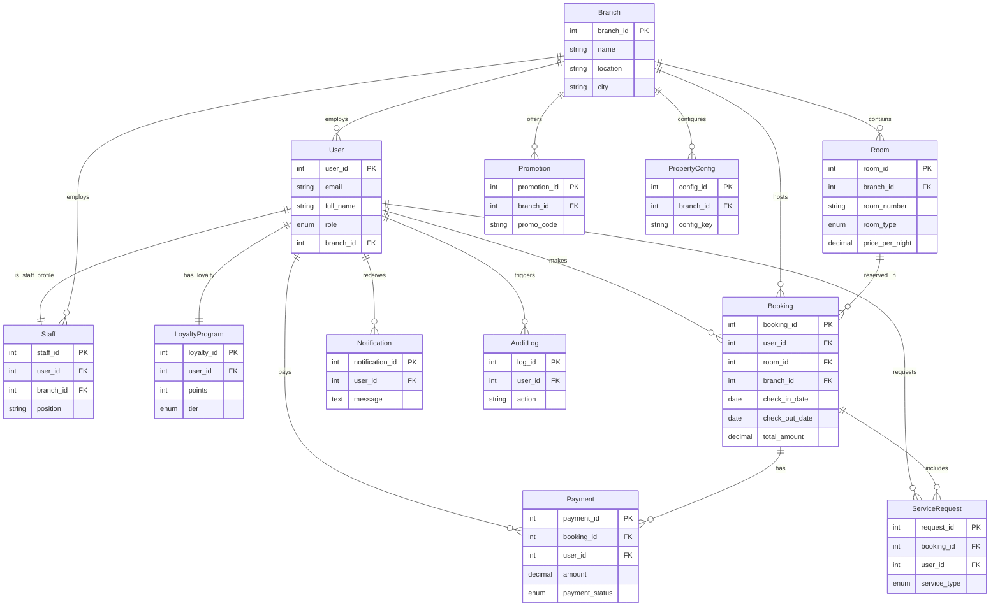

# Serendib Hotels - Database

MySQL database schema for the Serendib Smart Hotel Management System.

**Last Updated:** December 2024

## Quick Setup

### Using XAMPP (Recommended)
1. Start XAMPP MySQL
2. Open phpMyAdmin: http://localhost/phpmyadmin
3. Create database: `serendib_hotels`
4. Import: `schema.sql`

### Using Command Line
```bash
mysql -u root -p < schema.sql
```

### Fix Passwords (Required!)
After importing, run password fix:
```bash
cd ../serendib-backend
source venv/Scripts/activate
python fix_passwords.py
```

## Database Tables

| Table | Description |
|-------|-------------|
| **Branch** | Hotel locations (Colombo, Mirissa, Kandy) |
| **User** | All users (guests, staff, admins) |
| **Room** | Room inventory |
| **Booking** | Reservations |
| **Payment** | Transactions |
| **ServiceRequest** | Guest requests |
| **Notification** | System alerts |
| **Staff** | Staff details |
| **LoyaltyProgram** | Points & tiers |
| **AuditLog** | Audit trail |
| **PropertyConfig** | Branch configs |
| **Promotion** | Discount codes |

## Entity Relationship Diagram



</details>

## Test Credentials

After running `fix_passwords.py`:

| Role | Email | Password |
|------|-------|----------|
| Admin | `admin@serendibhotels.lk` | `admin123` |
| Staff | `staff1.colombo@serendibhotels.lk` | `staff123` |
| Guest | `john.doe@example.com` | `guest123` |

## Sample Data

- **3 Branches** - Colombo, Mirissa, Kandy
- **12 Users** - Admins, Staff, Guests
- **16 Rooms** - Various types
- **5 Bookings** - Sample reservations
- **4 Promotions** - Active discounts

## Database Features

### Views
- `vw_room_availability` - Real-time availability
- `vw_revenue_summary` - Revenue analytics
- `vw_booking_dashboard` - Booking overview

### Stored Procedures
- `sp_check_room_availability()` - Check dates
- `sp_calculate_loyalty_points()` - Update points

### Triggers
- Auto-create loyalty on registration
- Update room status on booking
- Audit logging

## Backup

```bash
# Backup
mysqldump -u root -p serendib_hotels > backup.sql

# Restore
mysql -u root -p serendib_hotels < backup.sql
```

## Notes

- Passwords: bcrypt hashed
- Tax rates: Colombo 15%, Mirissa 12%, Kandy 13%
- Loyalty: Bronze, Silver, Gold, Platinum

## License

© 2024 Serendib Hotels
